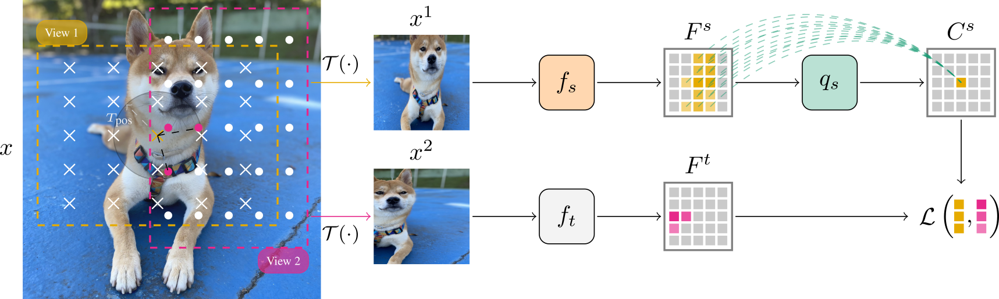

# Self-supervised Learning of Contextualized Local Visual Embeddings

By [Thalles Silva](https://sthalles.github.io/), [Helio Pedrini](https://www.ic.unicamp.br/~helio/), [Adín Ramírez Rivera](https://scholar.google.com/citations?user=p2aLoZAAAAAJ&hl=en).

This repo is the official implementation of **Self-supervised Learning of Contextualized Local Visual Embeddings** (CLoVE), featured on the 4th Visual Inductive Priors for Data-Efficient Deep Learning Workshop (ICCV2023).

Code base written in PyTorch.

## Abstract

*We present Contextualized Local Visual Embeddings (CLoVE), a self-supervised convolutional-based method that learns representations suited for dense prediction tasks. CLoVE deviates from current methods and optimizes a single loss function that operates at the level of contextualized local embeddings learned from output feature maps of convolution neural network (CNN) encoders. To learn contextualized embeddings, CLoVE proposes a normalized multi-head self-attention layer that combines local features from different parts of an image based on similarity. We extensively benchmark CLoVE’s pre-trained representations on multiple datasets. CLoVE reaches state-of-the-art performance for CNN-based architectures in 4 dense prediction downstream tasks, including object detection, instance segmentation, keypoint detection, and dense pose estimation.*

<div align="center">
    
</div>


## Citation

```
@inproceedings{silva2023self,
    title={Self-supervised Learning of Contextualized Local Visual Embeddings},
    author={Silva, Thalles and Pedrini, Helio and Ram{\'\i}rez, Ad{\'\i}n},
    booktitle={Proceedings of the IEEE/CVF International Conference on Computer Vision},
    pages={177--186},
    year={2023}
}
```

## Main Results

### Pre-trained models

<div>
  <table class="table table-hover">
      <thead>
        <tr>
          <th scope="col"></th>
          <th scope="col">Epochs</th>
          <th scope="col">Multicrop</th>
          <th scope="col">URL</th>
        </tr>
      </thead>
      <tbody class="table-group-divider w-auto">
        <tr>
          <th scope="row">CLoVE</th>
          <td>50</td>
          <td>2x224 + 6x96</td>
          <td><a class="link-opacity-75-hover" href="https://drive.google.com/drive/folders/1LKWsiOGpVlZGBaI7xiKD4VeZmsWyHoNW?usp=sharing">Checkpoints</a></td>
        </tr>
        <tr>
          <th scope="row">CLoVE</th>
          <td>200</td>
          <td>2x224 + 6x96</td>
          <td><a class="link-opacity-75-hover" href="https://drive.google.com/drive/folders/1-LUvP6TcM81qTZW8iOAk_mkrmb3WnII_?usp=sharing">Checkpoints</a></td>
        </tr>
        <tr>
          <th scope="row">CLoVE</th>
          <td>400</td>
          <td>2x224 + 6x96</td>
          <td><a class="link-opacity-75-hover" href="https://drive.google.com/drive/folders/1HEsvFuxNqvFPqNzcJt8DBMG_RuHEBSa0?usp=sharing">Checkpoints</a></td>
        </tr>
      </tbody>
    </table>
</div>

### Object detection and instance segmentation on COCO (R50-C4)

| Method                                | ep   | $\text{AP}^{\text{bb}}$ | $\text{AP}^{\text{bb}}_{50}$ | $\text{AP}^{\text{bb}}_{75}$ | $\text{AP}^{\text{mb}}$ | $\text{AP}^{\text{mb}}_{50}$ | $\text{AP}^{\text{mb}}_{75}$ |
|---------------------------------------|------|------------------|------------------------------|------------------------------|------------------|------------------------------|------------------------------|
| Supervised                            | 100  | 38.2             | 58.2                         | 41.2                         | 33.3             | 54.7                         | 35.2                         |
| Rand init                             | - | 26.4             | 44                           | 27.8                         | 29.3             | 46.9                         | 30.8                         |
| ReSim          | 200  | 39.7             | 59                           | 43                           | 34.6             | 55.9                         | 37.1                         |
| InsCon         | 200  | 40.3             | 60.0                 | 43.5                         | 35.1             | 56.7                         | 37.6                         |
| PixPro       | 400  | 40.5             | 59.8                         | 44                           | 35.4     | 56.9}                 | 37.7                         |
| DetCo            | 200  | 39.8             | 59.7                         | 43                           | 34.7             | 56.3                         | 36.7                         |
| SlotCon | 200  | 39.9             | 59.8                         | 43.0                         | 34.9             | 56.5                         | 37.3                         |
| CLoVE                           | 200  | 40.6     | 60.0                 | 44.1                 | 35.4     | 56.8                         | 37.8                 |
| CLoVE           | 400  |  **41.0**   |  **60.3**               |  **44.2**               |  **35.5**   |  **57.2**               |  **38.1**               |


### Object detection and instance segmentation on LVIS (R50-FPN)

| Method                                | ep   | $\textup{AP}^{\textup{bb}}$ | $\textup{AP}^{\textup{bb}}_{50}$ | $\textup{AP}^{\textup{bb}}_{75}$ | $\textup{AP}^{\textup{mb}}$ | $\textup{AP}^{\textup{mb}}_{50}$ | $\textup{AP}^{\textup{mb}}_{75}$ |
|---------------------------------------|------|--------------------|----------------------------------|----------------------------------|--------------------|----------------------------------|----------------------------------|
| Supervised                            | 100  | 20.2               | 33.4                             | 21.4                             | 19.6               | 31.2                             | 20.8                             |
| Rand init                             | - | 12.4               | 21.8                             | 12.5                             | 12.1               | 20.2                             | 12.5                             |
| DenseCL         | 200  | 20.4               | 33.5                             | 21.4                             | 19.9               | 31.5                             | 20.9                             |
| PixPro       | 400  | 23.8       | 38.2                     | 25.2                     | 23.3       | 36.1                     | 24.7                             |
| SlotCon | 200  | 23.2               | 37.6                             | 24.3                             | 22.9               | 35.6                             | 24.3                             |
| VICRegL     | 200  | 7                  | 13.4                             | 6.4                              | 7.4                | 12.7                             | 7.3                              |
| CLoVE                           | 200  | 23.6               | 37.7                             | 25.2                     | 23.3       | 35.9                             | 24.8                     |
|                                       | 400  |  **24.3**     |  **38.8**                   |  **25.8**                   |  **23.9**     |  **36.7**                   |  **25.3**                   |


### Instance segmentation on Cityscapes (R50-FPN)

| Method                                | ep   | AP             | $\textup{AP}_{50}$ |
|---------------------------------------|------|----------------|--------------------|
| Supervised                            | 100  | 26.5           | 52.9               |
| Rand init                             | - | 19.9           | 40.7               |
| DenseCL         | 200  | 33.1           | 61.7               |
| PixPro       | 400  | 35.8   | 63.7               |
| VICRegL     | 300  | 29.8           | 58.5               |
| SlotCon | 200  | 35.2           | 63.8               |
| CLoVE                           | 200  | 35.7           | 64.1       |
| CLoVE                           | 400  |  **37.2** |  **65.3**     |

## Acknowledgement

This repository was built on top of several existing publicly available codes. Specifically, we have modified and integrated the following code into this project:

* https://github.com/zdaxie/PixPro


## Contributing to the project

We welcome pull requests and issues from the community.
